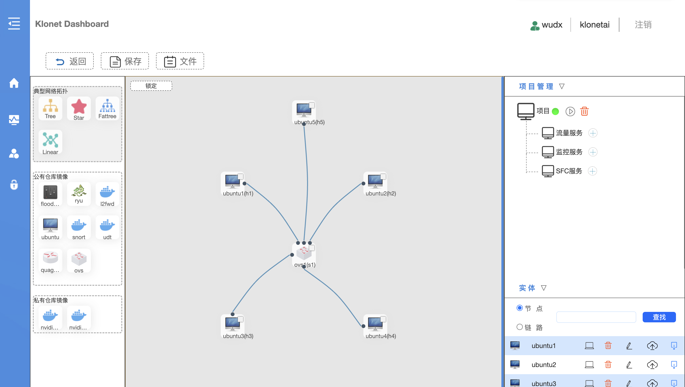

<br>
<p align="center">
  
</p>

This repo provides an AI agent for intelligent interaction with the 
Klonet platform. Some examples are provided to show what this repo 
is used for, as below.

```python
import tool
import tutorial
import inspect
from transformers.tools import OpenAiAgent
from key import OpenAI_API_Key

# Collect our KlonetAI tools.
klonetai_tools = [obj() for obj in tool.free_tools] 
klonetai_tools += [obj() for obj in tool.gpt_tools]  # note: these are not free.
klonetai_tools += [obj() for obj in tutorial.tutorials]

# Instantiate the Agent with our KlonetAI tools.
agent = OpenAiAgent(
    model="gpt-3.5-turbo", 
    api_key=OpenAI_API_Key, 
    additional_tools=custom_tools
)

# Replace the default summarizer with our GPT summarizer.
agent.toolbox["summarizer"] = tool.SummarizeTool()

# List all tools we have.
print(agent.toolbox.keys())
```

Next, we can use <code>agent</code> to interact with KlonetAI. For example:

### Case 1: Basic Usage
#### 1. Create a network with star topology

```python
>>> agent.chat("Create a star network with 5 host nodes and 1 ovs switch, and deploy it. "
"Set node positions and link IPs to form a star shape.")
```
```text
Outputs:

==Explanation from the agent==
To create a star network with 5 host nodes and 1 OVS switch, you can use the following code:


==Code generated by the agent==
# Add the OVS switch
klonet_add_node("s1", "ovs", x=350, y=350)

# Add the host nodes
klonet_add_node("h1", "ubuntu", x=200, y=200)
klonet_add_node("h2", "ubuntu", x=500, y=200)
klonet_add_node("h3", "ubuntu", x=200, y=500)
klonet_add_node("h4", "ubuntu", x=500, y=500)
klonet_add_node("h5", "ubuntu", x=350, y=50)

# Add links between the host nodes and the switch
klonet_add_link("h1", "s1", "l1", "10.0.0.2/24")
klonet_add_link("h2", "s1", "l2", "10.0.0.3/24")
klonet_add_link("h3", "s1", "l3", "10.0.0.4/24")
klonet_add_link("h4", "s1", "l4", "10.0.0.5/24")
klonet_add_link("h5", "s1", "l5", "10.0.0.6/24")

# Deploy the network
klonet_deploy_network()


==Result==
A new node (name: s1, image: switch/ovs, resource limit: {'cpu': None, 'mem': None}) have been added to the network.
A new node (name: h1, image: host/ubuntu, resource limit: {'cpu': None, 'mem': None}) have been added to the network.
A new node (name: h2, image: host/ubuntu, resource limit: {'cpu': None, 'mem': None}) have been added to the network.
A new node (name: h3, image: host/ubuntu, resource limit: {'cpu': None, 'mem': None}) have been added to the network.
A new node (name: h4, image: host/ubuntu, resource limit: {'cpu': None, 'mem': None}) have been added to the network.
A new node (name: h5, image: host/ubuntu, resource limit: {'cpu': None, 'mem': None}) have been added to the network.
A link with name (l1) was added between nodes h1 (IP: 10.0.0.2/24) and s1
A link with name (l2) was added between nodes h2 (IP: 10.0.0.3/24) and s1
A link with name (l3) was added between nodes h3 (IP: 10.0.0.4/24) and s1
A link with name (l4) was added between nodes h4 (IP: 10.0.0.5/24) and s1
A link with name (l5) was added between nodes h5 (IP: 10.0.0.6/24) and s1
Deployment progress: 0 %
...
Deployment progress: 100 %
Deploy project klonetai success.
```

<p align="center">
  
</p>

#### Execute commands on these hosts

```python
# Now, let us execute some commands in these hosts:
>>> agent.chat("all host nodes ping h1")
```
```text
Outputs:

==Explanation from the agent==
To ping host `h1` from all the other host nodes, you can use the `klonet_command_exec` tool. Here's the code:


==Code generated by the agent==
output_h2 = klonet_command_exec("h2", "ping -c 3 10.0.0.2")
output_h3 = klonet_command_exec("h3", "ping -c 3 10.0.0.2")
output_h4 = klonet_command_exec("h4", "ping -c 3 10.0.0.2")
output_h5 = klonet_command_exec("h5", "ping -c 3 10.0.0.2")

print(output_h2)
print(output_h3)
print(output_h4)
print(output_h5)


==Result==
PING 10.0.0.2 (10.0.0.2) 56(84) bytes of data.
64 bytes from 10.0.0.2: icmp_seq=1 ttl=64 time=0.780 ms
64 bytes from 10.0.0.2: icmp_seq=2 ttl=64 time=0.073 ms
64 bytes from 10.0.0.2: icmp_seq=3 ttl=64 time=0.064 ms

--- 10.0.0.2 ping statistics ---
3 packets transmitted, 3 received, 0% packet loss, time 2055ms
rtt min/avg/max/mdev = 0.064/0.305/0.780/0.336 ms
PING 10.0.0.2 (10.0.0.2) 56(84) bytes of data.
64 bytes from 10.0.0.2: icmp_seq=1 ttl=64 time=0.699 ms
64 bytes from 10.0.0.2: icmp_seq=2 ttl=64 time=0.085 ms
64 bytes from 10.0.0.2: icmp_seq=3 ttl=64 time=0.062 ms

--- 10.0.0.2 ping statistics ---
3 packets transmitted, 3 received, 0% packet loss, time 2041ms
rtt min/avg/max/mdev = 0.062/0.282/0.699/0.295 ms
PING 10.0.0.2 (10.0.0.2) 56(84) bytes of data.
64 bytes from 10.0.0.2: icmp_seq=1 ttl=64 time=0.756 ms
64 bytes from 10.0.0.2: icmp_seq=2 ttl=64 time=0.054 ms
64 bytes from 10.0.0.2: icmp_seq=3 ttl=64 time=0.063 ms

--- 10.0.0.2 ping statistics ---
3 packets transmitted, 3 received, 0% packet loss, time 2028ms
rtt min/avg/max/mdev = 0.054/0.291/0.756/0.328 ms
PING 10.0.0.2 (10.0.0.2) 56(84) bytes of data.
64 bytes from 10.0.0.2: icmp_seq=1 ttl=64 time=0.809 ms
64 bytes from 10.0.0.2: icmp_seq=2 ttl=64 time=0.057 ms
64 bytes from 10.0.0.2: icmp_seq=3 ttl=64 time=0.089 ms

--- 10.0.0.2 ping statistics ---
3 packets transmitted, 3 received, 0% packet loss, time 2055ms
rtt min/avg/max/mdev = 0.057/0.318/0.809/0.347 ms
```

#### Link Configuration

```python
agent.chat("Set the bandwidth and the delay between h1 and s1 to 5mbps and 10us, respectively.")
```
```text
Outputs:

==Explanation from the agent==
To set the bandwidth and delay between `h1` and `s1`, you can use the `klonet_configure_link` tool. Here's the code:


==Code generated by the agent==
klonet_configure_link(link_name="l1", node_name="h1", bandwidth=5000, delay=10)


==Result==
{'code': 1, 'msg': '链路TC配置成功'}
Link l1 (on the h1 side) is configured with: {'link': 'l1', 'ne': 'h1', 'bw_kbps': 5000, 'delay_us': 10}
```

```python
>>> agent.chat("Start iperf server on h2 and measure the bandwidth between h1 and h2.")
```
```text
Outputs:

==Explanation from the agent==
To start the iperf server on `h2` and measure the bandwidth between `h1` and `h2`, you can use the following code:


==Code generated by the agent==
# Start the iperf server on h2
klonet_command_exec("h2", "iperf -s -D")

# Measure the bandwidth between h1 and h2
output = klonet_command_exec("h1", "iperf -c 10.0.0.3")
print(output)


==Result==
------------------------------------------------------------
Client connecting to 10.0.0.3, TCP port 5001
TCP window size: 85.0 KByte (default)
------------------------------------------------------------
[  3] local 10.0.0.2 port 50366 connected with 10.0.0.3 port 5001
[ ID] Interval       Transfer     Bandwidth
[  3]  0.0-10.0 sec  6.75 MBytes  5.65 Mbits/sec
```

```python
>>> agent.chat("Reset link l1.")
```
```text
Outputs:

==Explanation from the agent==
To reset link `l1`, you can use the `klonet_reset_link` tool. Here's the code:


==Code generated by the agent==
klonet_reset_link("l1")


==Result==
Link l1 has been reset.
```

```python
>>> agent.chat("Start iperf server on h2 and measure the bandwidth between h1 and h2.")
```
```text
Outputs:

==Explanation from the agent==
To start the iperf server on `h2` and measure the bandwidth between `h1` and `h2`, you can use the following code:


==Code generated by the agent==
# Start the iperf server on h2
klonet_command_exec("h2", "iperf -s -D")

# Measure the bandwidth between h1 and h2
output = klonet_command_exec("h1", "iperf -c 10.0.0.3")
print(output)


==Result==
------------------------------------------------------------
Client connecting to 10.0.0.3, TCP port 5001
TCP window size: 85.0 KByte (default)
------------------------------------------------------------
[  3] local 10.0.0.2 port 49338 connected with 10.0.0.3 port 5001
[ ID] Interval       Transfer     Bandwidth
[  3]  0.0-10.0 sec  31.4 GBytes  26.9 Gbits/sec
```

#### Delete this network

```python
>>> agent.run("Delete project.")
```
```text
Outputs:

==Explanation from the agent==
I will use the following tool: `klonet_destroy_project` to delete the project.


==Code generated by the agent==
klonet_destroy_project()


==Result==
Destruction progress: 0 %
...
Destruction progress: 100 %
This project has been deleted.
```

### Case 2: Create a Star Topology and Launch MXNET Distributed Training
```python
>>> agent.chat("Create a star network with 6 nodes and 1 ovs, " 
"deploy 1 MXNET scheduler, 2 MXNET server, and 3 MXNET workers on these " 
"nodes, and run MXNET jobs. The scheduler is launched on IP 192.168.1.22. " 
"Do not use ListComp and BinOp, write the codes line by line instead.")
```
```text
Outputs:

==Explanation from the agent==
I will use the following tools: `klonet_add_node` to add nodes to the network, `klonet_add_link` to create network links between nodes, `klonet_deploy_network` to deploy the network, and `klonet_command_exec` to run MXNET jobs.


==Code generated by the agent==
# Add nodes to the network
node1 = klonet_add_node(name="node1")
node2 = klonet_add_node(name="node2")
node3 = klonet_add_node(name="node3")
node4 = klonet_add_node(name="node4")
node5 = klonet_add_node(name="node5")
node6 = klonet_add_node(name="node6")
ovs = klonet_add_node(name="ovs", image="ovs")

# Create network links
klonet_add_link(src_node="node1", dst_node="ovs")
klonet_add_link(src_node="node2", dst_node="ovs")
klonet_add_link(src_node="node3", dst_node="ovs")
klonet_add_link(src_node="node4", dst_node="ovs")
klonet_add_link(src_node="node5", dst_node="ovs")
klonet_add_link(src_node="node6", dst_node="ovs")

# Deploy the network
klonet_deploy_network(project_name="star_network")

# Run MXNET jobs
klonet_command_exec(node_name="node1", command="DMLC_ROLE=scheduler DMLC_PS_ROOT_URI=192.168.1.22 DMLC_PS_ROOT_PORT=9092 DMLC_NUM_SERVER=2 DMLC_NUM_WORKER=3 python mxnet_job.py")
klonet_command_exec(node_name="node2", command="DMLC_ROLE=server DMLC_PS_ROOT_URI=192.168.1.22 DMLC_PS_ROOT_PORT=9092 DMLC_NUM_SERVER=2 DMLC_NUM_WORKER=3 python mxnet_job.py")
klonet_command_exec(node_name="node3", command="DMLC_ROLE=server DMLC_PS_ROOT_URI=192.168.1.22 DMLC_PS_ROOT_PORT=9092 DMLC_NUM_SERVER=2 DMLC_NUM_WORKER=3 python mxnet_job.py")
klonet_command_exec(node_name="node4", command="DMLC_ROLE=worker DMLC_PS_ROOT_URI=192.168.1.22 DMLC_PS_ROOT_PORT=9092 DMLC_NUM_SERVER=2 DMLC_NUM_WORKER=3 python mxnet_job.py")
klonet_command_exec(node_name="node5", command="DMLC_ROLE=worker DMLC_PS_ROOT_URI=192.168.1.22 DMLC_PS_ROOT_PORT=9092 DMLC_NUM_SERVER=2 DMLC_NUM_WORKER=3 python mxnet_job.py")
klonet_command_exec(node_name="node6", command="DMLC_ROLE=worker DMLC_PS_ROOT_URI=192.168.1.22 DMLC_PS_ROOT_PORT=9092 DMLC_NUM_SERVER=2 DMLC_NUM_WORKER=3 python mxnet_job.py")


==Result==
Calling Klonet Add Node API ...
A new node (name: node1, image: ubuntu, cpu_limit: None, mem_limit: None) have been added to the network, now we have 13 nodes.
Calling Klonet Add Node API ...
A new node (name: node2, image: ubuntu, cpu_limit: None, mem_limit: None) have been added to the network, now we have 14 nodes.
Calling Klonet Add Node API ...
A new node (name: node3, image: ubuntu, cpu_limit: None, mem_limit: None) have been added to the network, now we have 15 nodes.
Calling Klonet Add Node API ...
A new node (name: node4, image: ubuntu, cpu_limit: None, mem_limit: None) have been added to the network, now we have 16 nodes.
Calling Klonet Add Node API ...
A new node (name: node5, image: ubuntu, cpu_limit: None, mem_limit: None) have been added to the network, now we have 17 nodes.
Calling Klonet Add Node API ...
A new node (name: node6, image: ubuntu, cpu_limit: None, mem_limit: None) have been added to the network, now we have 18 nodes.
Calling Klonet Add Node API ...
A new node (name: ovs, image: ovs, cpu_limit: None, mem_limit: None) have been added to the network, now we have 19 nodes.
Calling Klonet Add Link API ...
A link with name (None) was added between nodes node1 (ip: ) and ovs (ip: )
Calling Klonet Add Link API ...
A link with name (None) was added between nodes node2 (ip: ) and ovs (ip: )
Calling Klonet Add Link API ...
A link with name (None) was added between nodes node3 (ip: ) and ovs (ip: )
Calling Klonet Add Link API ...
A link with name (None) was added between nodes node4 (ip: ) and ovs (ip: )
Calling Klonet Add Link API ...
A link with name (None) was added between nodes node5 (ip: ) and ovs (ip: )
Calling Klonet Add Link API ...
A link with name (None) was added between nodes node6 (ip: ) and ovs (ip: )
Calling Klonet Deploy Network API ...
Deploy project star_network success.
Calling Klonet Exec Command API ...
Feedback from node1 after calling DMLC_ROLE=scheduler DMLC_PS_ROOT_URI=192.168.1.22 DMLC_PS_ROOT_PORT=9092 DMLC_NUM_SERVER=2 DMLC_NUM_WORKER=3 python mxnet_job.py.
Calling Klonet Exec Command API ...
Feedback from node2 after calling DMLC_ROLE=server DMLC_PS_ROOT_URI=192.168.1.22 DMLC_PS_ROOT_PORT=9092 DMLC_NUM_SERVER=2 DMLC_NUM_WORKER=3 python mxnet_job.py.
Calling Klonet Exec Command API ...
Feedback from node3 after calling DMLC_ROLE=server DMLC_PS_ROOT_URI=192.168.1.22 DMLC_PS_ROOT_PORT=9092 DMLC_NUM_SERVER=2 DMLC_NUM_WORKER=3 python mxnet_job.py.
Calling Klonet Exec Command API ...
Feedback from node4 after calling DMLC_ROLE=worker DMLC_PS_ROOT_URI=192.168.1.22 DMLC_PS_ROOT_PORT=9092 DMLC_NUM_SERVER=2 DMLC_NUM_WORKER=3 python mxnet_job.py.
Calling Klonet Exec Command API ...
Feedback from node5 after calling DMLC_ROLE=worker DMLC_PS_ROOT_URI=192.168.1.22 DMLC_PS_ROOT_PORT=9092 DMLC_NUM_SERVER=2 DMLC_NUM_WORKER=3 python mxnet_job.py.
Calling Klonet Exec Command API ...
Feedback from node6 after calling DMLC_ROLE=worker DMLC_PS_ROOT_URI=192.168.1.22 DMLC_PS_ROOT_PORT=9092 DMLC_NUM_SERVER=2 DMLC_NUM_WORKER=3 python mxnet_job.py.
```

### Case 3: Read Online Tutorials to Launch Klonet and Upper-Level Apps

```python
>>> doc = agent.run("Summarize how to manually launch MXNET jobs from "
"https://mxnet.apache.org/versions/1.9.1/api/faq/distributed_training")
print(len(doc))
```
```text
==Explanation from the agent==
I will use the following tool: `summarizer` to summarize the tutorial text from the given URL.


==Code generated by the agent==
url = "https://mxnet.apache.org/versions/1.9.1/api/faq/distributed_training"
tutorial = text_downloader(url)
summary = summarizer(context=tutorial, query="How to manually launch MXNET jobs?")
print(f"The summary is: {summary}")


==Result==
The summary is: To manually launch MXNet jobs, you can set the required environment variables and execute the training command on each machine. Here is an example for launching jobs locally on Linux/Mac machines:


shell
export COMMAND='python example/gluon/image_classification.py --dataset cifar10 --model vgg11 --epochs 1 --kvstore dist_sync'
DMLC_ROLE=server DMLC_PS_ROOT_URI=127.0.0.1 DMLC_PS_ROOT_PORT=9092 DMLC_NUM_SERVER=2 DMLC_NUM_WORKER=2 $COMMAND &
DMLC_ROLE=server DMLC_PS_ROOT_URI=127.0.0.1 DMLC_PS_ROOT_PORT=9092 DMLC_NUM_SERVER=2 DMLC_NUM_WORKER=2 $COMMAND &
DMLC_ROLE=scheduler DMLC_PS_ROOT_URI=127.0.0.1 DMLC_PS_ROOT_PORT=9092 DMLC_NUM_SERVER=2 DMLC_NUM_WORKER=2 $COMMAND &
DMLC_ROLE=worker DMLC_PS_ROOT_URI=127.0.0.1 DMLC_PS_ROOT_PORT=9092 DMLC_NUM_SERVER=2 DMLC_NUM_WORKER=2 $COMMAND &
DMLC_ROLE=worker DMLC_PS_ROOT_URI=127.0.0.1 DMLC_PS_ROOT_PORT=9092 DMLC_NUM_SERVER=2 DMLC_NUM_WORKER=2 $COMMAND


Make sure to replace `$COMMAND` with the appropriate command for your training job. This example assumes that you have the `image_classification.py` script accessible on all machines in the cluster.

Note that starting all jobs on the same machine is not recommended for production environments.
1199
```

```python
>>> agent.run(f'''
=== Tutorials ===
{doc}

=== Task to be executed ===
Create a star network with 6 host nodes and 1 ovs node, then run
a MXNET scheduler, two MXNET server, and three MXNET workers on 
the host nodes. The scheduler is launched on host node with IP 192.168.1.22. 
Do not use ListComp and BinOp, write the codes line by line instead.
''')
```
```text
==Explanation from the agent==
I will use the following tools: `klonet_add_node` to add the host and ovs nodes, `klonet_add_link` to create the network links, and `klonet_command_exec` to run the MXNET scheduler, servers, and workers on the host nodes.


==Code generated by the agent==
# Add the host nodes
h1 = klonet_add_node(name="h1", image="ubuntu")
h2 = klonet_add_node(name="h2", image="ubuntu")
h3 = klonet_add_node(name="h3", image="ubuntu")
h4 = klonet_add_node(name="h4", image="ubuntu")
h5 = klonet_add_node(name="h5", image="ubuntu")
h6 = klonet_add_node(name="h6", image="ubuntu")

# Add the ovs node
s1 = klonet_add_node(name="s1", image="ovs")

# Create network links
klonet_add_link(src_node="h1", dst_node="s1")
klonet_add_link(src_node="h2", dst_node="s1")
klonet_add_link(src_node="h3", dst_node="s1")
klonet_add_link(src_node="h4", dst_node="s1")
klonet_add_link(src_node="h5", dst_node="s1")
klonet_add_link(src_node="h6", dst_node="s1")

# Run MXNET scheduler, servers, and workers on the host nodes
klonet_command_exec(node_name="h1", command="DMLC_ROLE=scheduler DMLC_PS_ROOT_URI=192.168.1.22 DMLC_PS_ROOT_PORT=9092 DMLC_NUM_SERVER=2 DMLC_NUM_WORKER=3 python example/gluon/image_classification.py --dataset cifar10 --model vgg11 --epochs 1 --kvstore dist_sync")
klonet_command_exec(node_name="h2", command="DMLC_ROLE=server DMLC_PS_ROOT_URI=192.168.1.22 DMLC_PS_ROOT_PORT=9092 DMLC_NUM_SERVER=2 DMLC_NUM_WORKER=3 python example/gluon/image_classification.py --dataset cifar10 --model vgg11 --epochs 1 --kvstore dist_sync")
klonet_command_exec(node_name="h3", command="DMLC_ROLE=server DMLC_PS_ROOT_URI=192.168.1.22 DMLC_PS_ROOT_PORT=9092 DMLC_NUM_SERVER=2 DMLC_NUM_WORKER=3 python example/gluon/image_classification.py --dataset cifar10 --model vgg11 --epochs 1 --kvstore dist_sync")
klonet_command_exec(node_name="h4", command="DMLC_ROLE=worker DMLC_PS_ROOT_URI=192.168.1.22 DMLC_PS_ROOT_PORT=9092 DMLC_NUM_SERVER=2 DMLC_NUM_WORKER=3 python example/gluon/image_classification.py --dataset cifar10 --model vgg11 --epochs 1 --kvstore dist_sync")
klonet_command_exec(node_name="h5", command="DMLC_ROLE=worker DMLC_PS_ROOT_URI=192.168.1.22 DMLC_PS_ROOT_PORT=9092 DMLC_NUM_SERVER=2 DMLC_NUM_WORKER=3 python example/gluon/image_classification.py --dataset cifar10 --model vgg11 --epochs 1 --kvstore dist_sync")
klonet_command_exec(node_name="h6", command="DMLC_ROLE=worker DMLC_PS_ROOT_URI=192.168.1.22 DMLC_PS_ROOT_PORT=9092 DMLC_NUM_SERVER=2 DMLC_NUM_WORKER=3 python example/gluon/image_classification.py --dataset cifar10 --model vgg11 --epochs 1 --kvstore dist_sync")


==Result==
Calling Klonet Add Node API ...
A new node (name: h1, image: ubuntu, cpu_limit: None, mem_limit: None) have been added to the network.
Calling Klonet Add Node API ...
A new node (name: h2, image: ubuntu, cpu_limit: None, mem_limit: None) have been added to the network.
Calling Klonet Add Node API ...
A new node (name: h3, image: ubuntu, cpu_limit: None, mem_limit: None) have been added to the network.
Calling Klonet Add Node API ...
A new node (name: h4, image: ubuntu, cpu_limit: None, mem_limit: None) have been added to the network.
Calling Klonet Add Node API ...
A new node (name: h5, image: ubuntu, cpu_limit: None, mem_limit: None) have been added to the network.
Calling Klonet Add Node API ...
A new node (name: h6, image: ubuntu, cpu_limit: None, mem_limit: None) have been added to the network.
Calling Klonet Add Node API ...
A new node (name: s1, image: ovs, cpu_limit: None, mem_limit: None) have been added to the network.
Calling Klonet Add Link API ...
A link with name (None) was added between nodes h1 (ip: ) and s1 (ip: )
Calling Klonet Add Link API ...
A link with name (None) was added between nodes h2 (ip: ) and s1 (ip: )
Calling Klonet Add Link API ...
A link with name (None) was added between nodes h3 (ip: ) and s1 (ip: )
Calling Klonet Add Link API ...
A link with name (None) was added between nodes h4 (ip: ) and s1 (ip: )
Calling Klonet Add Link API ...
A link with name (None) was added between nodes h5 (ip: ) and s1 (ip: )
Calling Klonet Add Link API ...
A link with name (None) was added between nodes h6 (ip: ) and s1 (ip: )
Calling Klonet Exec Command API ...
Feedback from h1 after calling DMLC_ROLE=scheduler DMLC_PS_ROOT_URI=192.168.1.22 DMLC_PS_ROOT_PORT=9092 DMLC_NUM_SERVER=2 DMLC_NUM_WORKER=3 python example/gluon/image_classification.py --dataset cifar10 --model vgg11 --epochs 1 --kvstore dist_sync.
Calling Klonet Exec Command API ...
Feedback from h2 after calling DMLC_ROLE=server DMLC_PS_ROOT_URI=192.168.1.22 DMLC_PS_ROOT_PORT=9092 DMLC_NUM_SERVER=2 DMLC_NUM_WORKER=3 python example/gluon/image_classification.py --dataset cifar10 --model vgg11 --epochs 1 --kvstore dist_sync.
Calling Klonet Exec Command API ...
Feedback from h3 after calling DMLC_ROLE=server DMLC_PS_ROOT_URI=192.168.1.22 DMLC_PS_ROOT_PORT=9092 DMLC_NUM_SERVER=2 DMLC_NUM_WORKER=3 python example/gluon/image_classification.py --dataset cifar10 --model vgg11 --epochs 1 --kvstore dist_sync.
Calling Klonet Exec Command API ...
Feedback from h4 after calling DMLC_ROLE=worker DMLC_PS_ROOT_URI=192.168.1.22 DMLC_PS_ROOT_PORT=9092 DMLC_NUM_SERVER=2 DMLC_NUM_WORKER=3 python example/gluon/image_classification.py --dataset cifar10 --model vgg11 --epochs 1 --kvstore dist_sync.
Calling Klonet Exec Command API ...
Feedback from h5 after calling DMLC_ROLE=worker DMLC_PS_ROOT_URI=192.168.1.22 DMLC_PS_ROOT_PORT=9092 DMLC_NUM_SERVER=2 DMLC_NUM_WORKER=3 python example/gluon/image_classification.py --dataset cifar10 --model vgg11 --epochs 1 --kvstore dist_sync.
Calling Klonet Exec Command API ...
Feedback from h6 after calling DMLC_ROLE=worker DMLC_PS_ROOT_URI=192.168.1.22 DMLC_PS_ROOT_PORT=9092 DMLC_NUM_SERVER=2 DMLC_NUM_WORKER=3 python example/gluon/image_classification.py --dataset cifar10 --model vgg11 --epochs 1 --kvstore dist_sync.
```

This tool is currently under development. Please stay tuned for updates!